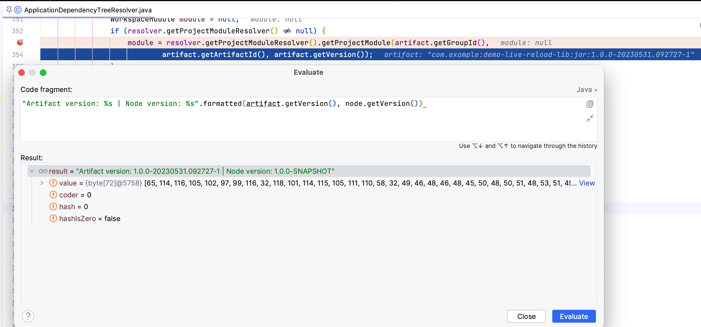
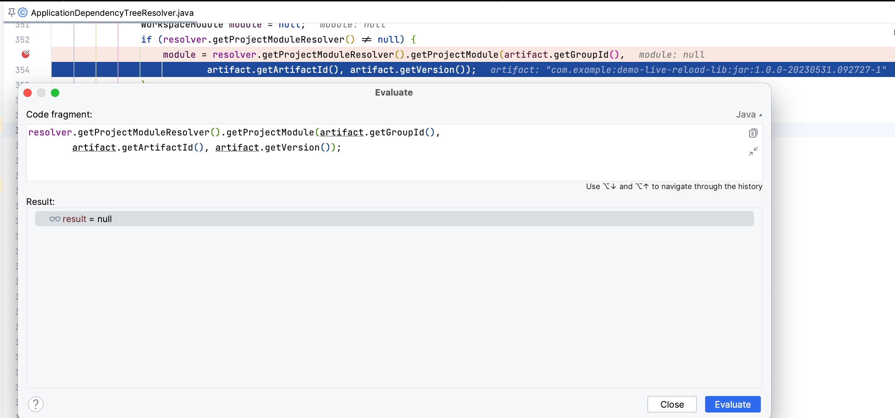
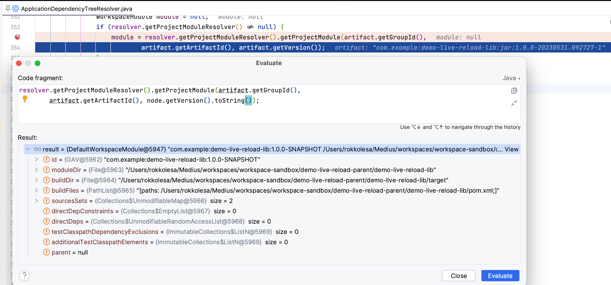

# Live reload fail demo

## Project structure
This is a multimodule project containing a `Quarkus` application (`demo-live-reload`) and a demo library project `demo-live-reload-lib`.
The `Quarkus` application has a dependency on the library.
This simulates a sort of "commons" library or a project containing JPA entities.

## How to run
The application can be run in Intellij IDEA with `Resolve workspace artifacts` option or just by using `mvn quarkus:dev` in the `demo-live-reload-parent/demo-live-reload` directory.
You can `mvn package` it if you want, but do **not** run `mvn install`.

## Expected behaviour
The `demo-live-reload-lib` should be reloadable and every change to any class inside it should be visible immediately in the `Quarkus` application.

## How to reproduce the problem
Initially, everything works as it should.
The problems appear when the library project versioned with the `-SNAPSHOT` suffix is deployed to a maven repository (e.g. Sonatype Nexus).

When this is true, `Quarkus` first resolves the library project in the multi-module workspace with the `1.0.0-SNAPSHOT` version.
It then fetches the artifact from the maven repository.

### Steps to reproduce
1. add the `<distributionManagement>` info to `demo-live-reload-parent/pom.xml`
2. `mvn deploy`
3. delete the `~/.m2/repository/com/example/demo-live-reload*` folders
4. `mvn clean`
5. `mvn quarkus:dev` in the `demo-live-reload-parent/demo-live-reload` folder
6. Visit `localhost:8080/hello`, you should see `Hello! Your id: id`
7. Change the string `"id"` in `ShouldBeReloadable` class to `"id2"`
8. Refresh the web page - nothing changes, live reload has not been run.

### Reason for the problems
We have debugged the `ApplicationDependencyTreeResolver` and found out that the `resolver. getProjectModuleResolver` does not resolve the workspace artifact if it versioned with `-SNAPSHOT` and the JAR was downloaded from nexus.
This is due to the mismatch of versions in the workspace and of the downloaded artifact:

The downloaded artifact is versioned as `1.0.0-20230531.092727-1` and the workspace artifact is versioned as `1.0.0-SNAPSHOT`.

The module resolution therefore fails:

However, if the module resolution would be done by using the `DependencyNode` instance (the one that was resolved by `pom.xml` traversal), the module resolution succeeds:

A fix for this problem is actually `mvn install` which installs the local JARs to `~/.m2/repository`.
This causes the "downloaded" JAR and the workspace JAR to have the same version: `1.0.0-SNAPSHOT` and live reload works as expected (step 8 from the above steps causes the web page to show `Hello! Your id: id2`).

This problem is especially prominent in projects where these commons libs are developed by us as we upload the `SNAPSHOT` versions to the maven repository.

(Disclaimer: we use `SNAPSHOT` version at the start of a project and during development of a feature.. the `main` branch is therefore always on a `SNAPSHOT` version until a release is made.. which then again results in a next `SNAPSHOT` version which is again deployed to the maven repository by CI/CD pipeline)